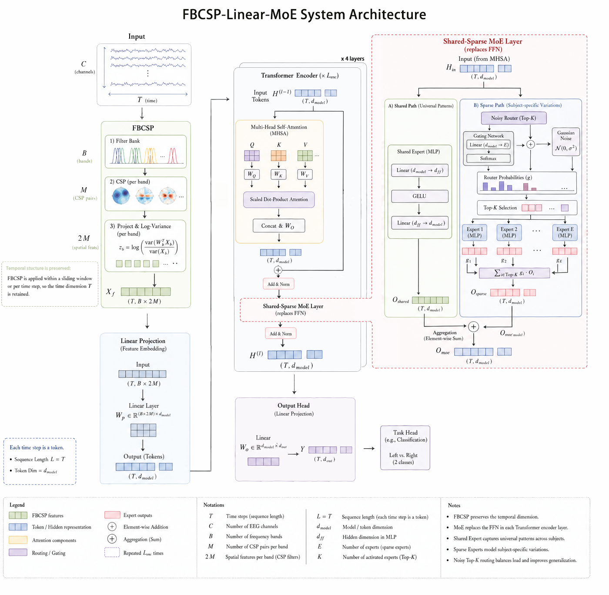
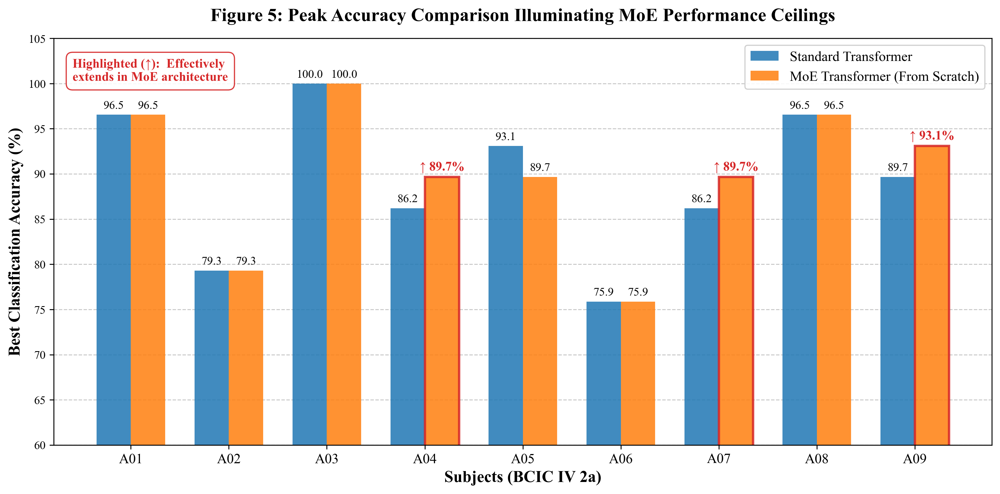

# Motor Imagery EEG Classification Based on Shared-Sparse MoE Transformer

[](https://www.python.org/downloads/)
[](https://pytorch.org/)
[](https://opensource.org/licenses/MIT)

Official PyTorch implementation of the Bachelor's Final Year Project: **"Research on Motor Imagery EEG Classification Based on Shared-Sparse MoE Transformer"**.

## 📖 Overview

Decoding Motor Imagery Electroencephalogram (MI-EEG) signals in Brain-Computer Interfaces (BCIs) is highly challenging due to low signal-to-noise ratios, limited training data, and high inter-subject variability. 

This repository introduces a **Shared-Sparse Mixture of Experts (MoE) Transformer** architecture to decouple universal neural patterns from subject-specific idiosyncrasies. 
* **Frontend:** Replaces deep, redundant CNNs with Filter Bank Common Spatial Patterns (FBCSP) followed by a lightweight Linear Projection.
* **Encoder:** Employs a Shared-Sparse MoE routing mechanism where a "shared expert" captures cross-subject universal patterns, and "sparse experts" adapt to individual variations.
* **Result:** Achieves an average accuracy of **83.91%** on the BCIC IV 2a dataset, outperforming classic baselines like EEGNet and DeepConvNet while reducing model parameters by 58.5%.



## ✨ Key Features

- **FBCSP-Linear Frontend:** Explicit spatial-spectral prior extraction eliminating the need for computationally heavy convolutional layers.
- **Dynamic Noisy Top-K Routing:** A MoE mechanism with 1 shared expert and 4 sparse experts (Top-2 routing) to prevent expert collapse and balance training loads.
- **Divide and Recombine (S&R) Augmentation:** A novel temporal augmentation strategy that synthesizes cross-trial sequences to prevent overfitting on small datasets.
- **High Interpretability:** Includes spatial-spectral attention saliency mapping to visualize physiological decoupling (Mu and Beta bands).

## 📁 Repository Structure

```text
├── checkpoints_final/       # Pre-trained and best model weights
├── process/                 # Core execution scripts
│   ├── run_master_pipeline.py       # One-click script to run all training & evaluation
│   ├── data_process_fbcsp_all.py    # EEG preprocessing & FBCSP feature extraction
│   ├── dataset_loader.py            # PyTorch Dataset with S&R augmentation
│   ├── train_experiment_20runs.py   # Main MoE model training (20 independent runs)
│   ├── train_baseline_dl_20runs.py  # Baseline training (EEGNet, DeepConvNet)
│   ├── eval_*.py                    # Evaluation scripts (XAI, Engineering metrics)
│   └── plot_figure_*.py             # Visualization scripts for thesis figures
└── structure/               # Neural Network Architectures
    ├── model/
    │   ├── model_moe.py             # Core MoE Transformer implementation
    │   ├── model_fbcsp_no_cnn.py    # Proposed Linear+MoE architecture
    │   ├── baseline_dl_models.py    # EEGNet & DeepConvNet baselines
    │   └── ablation_*.py            # Ablation study architectures
    └── cnn.py                       # CNN frontend implementations
```

## ⚙️ Installation & Requirements

1. Clone this repository:
```bash
git clone https://github.com/wushi2333/fyp2026.git
cd fyp2026
```

2. Install dependencies:
```bash
pip install torch torchvision torchaudio mne scikit-learn pandas matplotlib seaborn thop
```

## 🚀 How to Run

> **⚠️ Important Note:** Before running the scripts, please update the `CONFIG` dictionaries inside the Python files to match your local absolute paths for datasets and output directories (e.g., `data_root`, `save_dir`).

### 1. Dataset Download & Preparation
This project evaluates the model primarily on the **BCIC IV 2a** dataset, but the preprocessing script also supports **OpenBMI** and **PhysioNet**. Please download the raw data from their official sources:

* **BCIC IV 2a:** [BNCI Horizon 2020 (Dataset 2a)](http://bnci-horizon-2020.eu/database/data-sets) (Download the `.gdf` files)
* **OpenBMI:** [GigaDB (Lee 2019)](http://gigadb.org/dataset/100542)
* **PhysioNet:** [EEG Motor Movement/Imagery Dataset](https://physionet.org/content/eegmmidb/1.0.0/)

After downloading, organize your raw data and update the `bcic_dir`, `openbmi_root`, and `physionet_root` paths in `process/data_process_fbcsp_all.py`. Then run the preprocessing and FBCSP extraction script:
```bash
python process/data_process_fbcsp_all.py
```

### 2. Run the Full Experiment Pipeline
To reproduce the main results (Baseline vs. Proposed Model) with 20 independent runs and statistical t-tests, simply run:
```bash
python process/run_master_pipeline.py
```

### 3. Run Specific Experiments
You can also run specific parts of the project individually:
- **Train MoE Model:** `python process/train_experiment_20runs.py`
- **Train Baselines:** `python process/train_baseline_dl_20runs.py`
- **Ablation Studies:** `python process/train_ablation_experiments.py`

### 4. Evaluate and Visualize
Generate the figures used in the thesis (Topoplots, S&R Illustration, Accuracy Bar Charts, t-SNE, Saliency Maps):
```bash
python process/plot_figure_1_topoplots.py
python process/eval_xai_analysis.py
python process/eval_engineering_metrics.py
```

## 📊 Main Results

### Performance on BCIC IV 2a (Binary Classification: Left vs. Right Hand)
Results are averaged over 20 independent runs to ensure statistical reliability.

| Architecture | Parameters | FLOPs | Average Accuracy (%) |
| :--- | :---: | :---: | :---: |
| DeepConvNet | - | - | 80.27 ± 12.76 |
| EEGNet | 87.99 K | 4.64 M | 81.13 ± 13.65 |
| Standard CNN + MoE | 6.49 M | 414.03 M | 84.50 (Ablation) |
| **Proposed (Linear + MoE)** | **2.69 M** | **1.37 G** | **83.91 ± 10.18** |

*The proposed model successfully raises the absolute upper limits of classification for different subjects, avoiding the expert collapse problem often seen in small-scale EEG datasets.*

 

## 🔬 Explainability (XAI)
By decoupling physiological markers, the MoE architecture provides transparent routing. Spatial-spectral saliency maps reveal that the model correctly focuses on the **Mu band (8-12 Hz)** and **Beta band (13-30 Hz)**, dynamically adjusting to subjects with atypical frequency distributions (e.g., Subject A04).

## 🎓 Citation & Acknowledgements
This code is the result of a Final Year Project at the Glasgow College Hainan, UESTC. 
If you find this code or architecture useful in your research, please consider citing this repository.